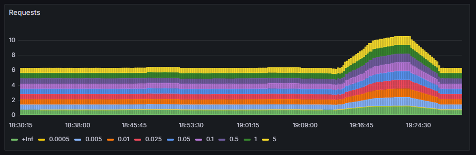
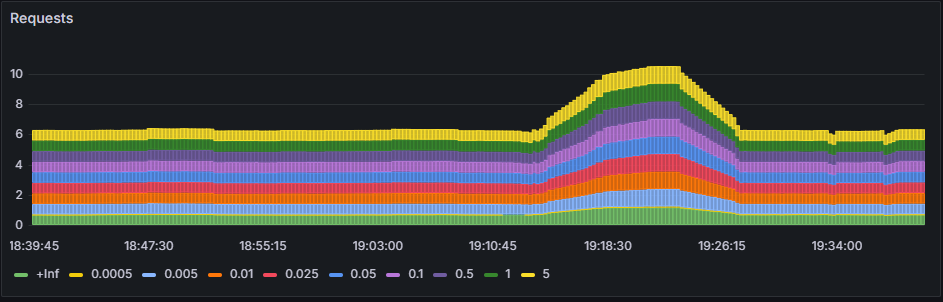
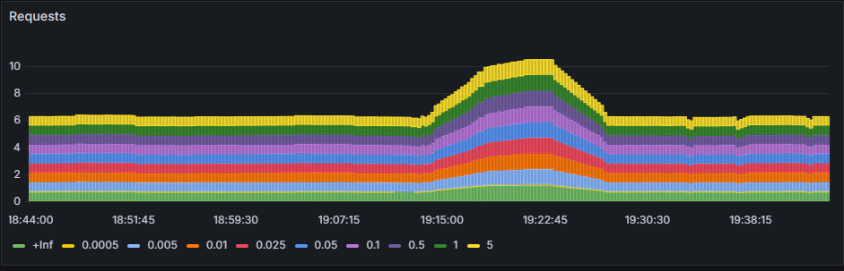
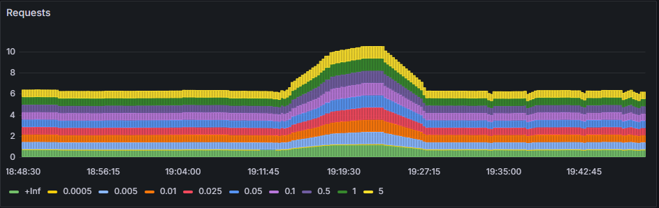

# Chaos Test

Starting pod state 7:32pm, bump in graph from earlier stress test.

```
node-api-deployment-7b6f59bf8d-5nfdj                   1/1     Running   0            91m 
node-api-deployment-7b6f59bf8d-b4mdr                   1/1     Running   0            91m 
node-api-deployment-7b6f59bf8d-rltxk                   1/1     Running   0            91m 
```

***
Deleting first pod 7:37pm, pod instantly recovered, small drop in graph, no noticeable difference in API response

```
node-api-deployment-7b6f59bf8d-5nfdj                   1/1     Terminating   0            95m
node-api-deployment-7b6f59bf8d-b4mdr                   1/1     Running       0            96m
node-api-deployment-7b6f59bf8d-h47qj                   1/1     Running       0            27s
node-api-deployment-7b6f59bf8d-rltxk                   1/1     Running       0            95m
```

***
Deleting second pod 7:42, pod instantly recovered, small drop in graph, no noticeable difference in API response
```
node-api-deployment-7b6f59bf8d-9z6kf                   1/1     Running       0            11s
node-api-deployment-7b6f59bf8d-b4mdr                   1/1     Running       0            104m
node-api-deployment-7b6f59bf8d-h47qj                   1/1     Terminating   0            9m21s
node-api-deployment-7b6f59bf8d-rltxk                   1/1     Running       0            104m
```


***
Deleting second pod 7:47, pod instantly recovered, small drop in graph, no noticeable difference in API response
```
node-api-deployment-7b6f59bf8d-9z6kf                   1/1     Running       0            5m8s
node-api-deployment-7b6f59bf8d-b4mdr                   1/1     Terminating   0            109m
node-api-deployment-7b6f59bf8d-rhxzx                   1/1     Running       0            6s
node-api-deployment-7b6f59bf8d-rltxk                   1/1     Running       0            109m
```




## Conclusion
With 1 pod being deleted every 5 minutes, the system instantly started a new pod when the deletion occurs. Proving that
this endpoint is highly available. Small blips can be seen in the graph reflecting when the service goes down, however
I could not feel this when accessing the API.